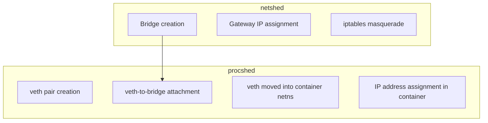

# Design

procshed is influenced by the approach of [MINCS](https://github.com/mhiramat/mincs) (Mini Container Shellscripts).

Designed as ephemeral, procshed delegates network infrastructure to [netshed](https://github.com/zinrai/netshed) and provides isolation through Linux namespaces and rootfs protection via overlayfs.

From procshed's perspective, a bridge created by netshed is simply an existing L2 switch — procshed just plugs a cable into it.

## Isolation Level

### What is implemented

| Item                        | Description                                                                 |
|-----------------------------|-----------------------------------------------------------------------------|
| PID namespace               | Only processes within the container are visible from inside                 |
| Mount namespace + overlayfs | Filesystem changes do not affect the host                                   |
| UTS namespace               | Hostname is independent per container                                       |
| IPC namespace               | System V IPC (shared memory, semaphores) is isolated                        |
| Net namespace               | Network interfaces, routing tables, and iptables are isolated               |
| /proc mount                 | Provides a /proc corresponding to the PID namespace                         |
| /sys read-only bind mount   | Exposes kernel device information as read-only                              |
| /dev individual bind mount  | Only /dev/null, /dev/zero, /dev/random, /dev/urandom, /dev/tty are provided |
| /dev/pts newinstance        | Pseudo-terminal set independent from the host                               |

### What is not implemented

| Item                   | Description                                                                   |
|------------------------|-------------------------------------------------------------------------------|
| Capabilities drop      | Processes inside the container retain root privileges                         |
| Seccomp filter         | No restrictions on system calls that processes inside the container can issue |
| /proc masked paths     | `/proc/kcore`, `/proc/keys`, etc. are readable from inside the container      |
| /sys partial masking   | `/sys/firmware`, etc. are readable from inside the container                  |
| User namespace         | Root inside the container is the same as root on the host                     |
| cgroup resource limits | No CPU or memory resource limits                                              |
| Container stop/restart | No upper layer persistence or restoration                                     |
| OCI image management   | rootfs must be prepared in advance using debootstrap or similar tools         |

### Comparison with Docker

| Item                        | procshed | Docker   |
|-----------------------------|----------|----------|
| PID namespace               | yes      | yes      |
| Mount namespace + overlayfs | yes      | yes      |
| UTS namespace               | yes      | yes      |
| IPC namespace               | yes      | yes      |
| Net namespace               | yes      | yes      |
| User namespace              | no       | optional |
| cgroup resource limits      | no       | yes      |
| Capabilities drop           | no       | yes      |
| Seccomp                     | no       | yes      |
| /proc masked paths          | no       | yes      |
| /sys partial masking        | no       | yes      |
| AppArmor / SELinux          | no       | optional |

procshed is intended for local use such as experimentation and development. It is not designed to defend against malicious processes or untrusted code execution.

## Influenced By

- [MINCS](https://github.com/mhiramat/mincs)
- [netnsplan](https://github.com/buty4649/netnsplan)
